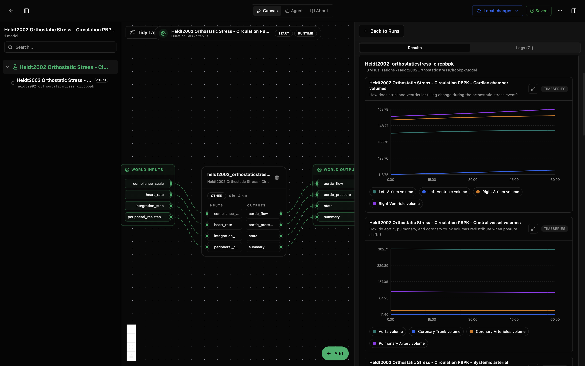
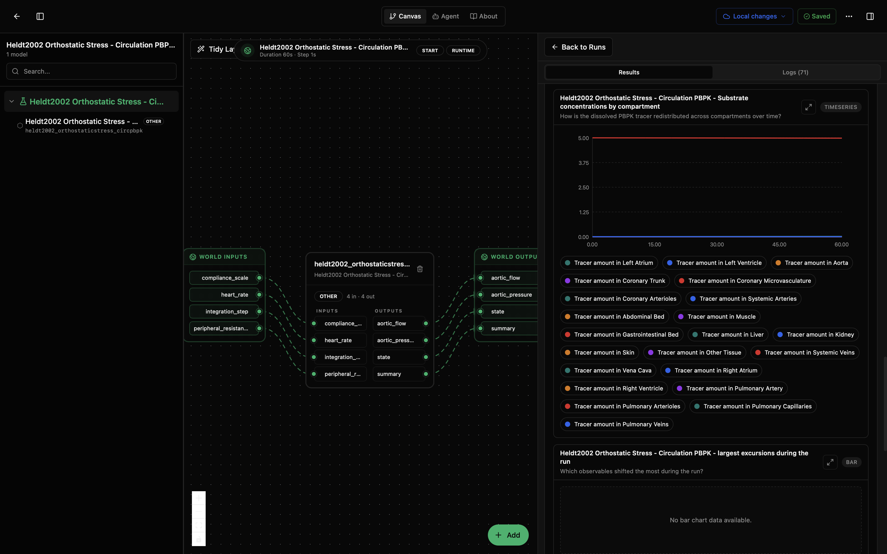
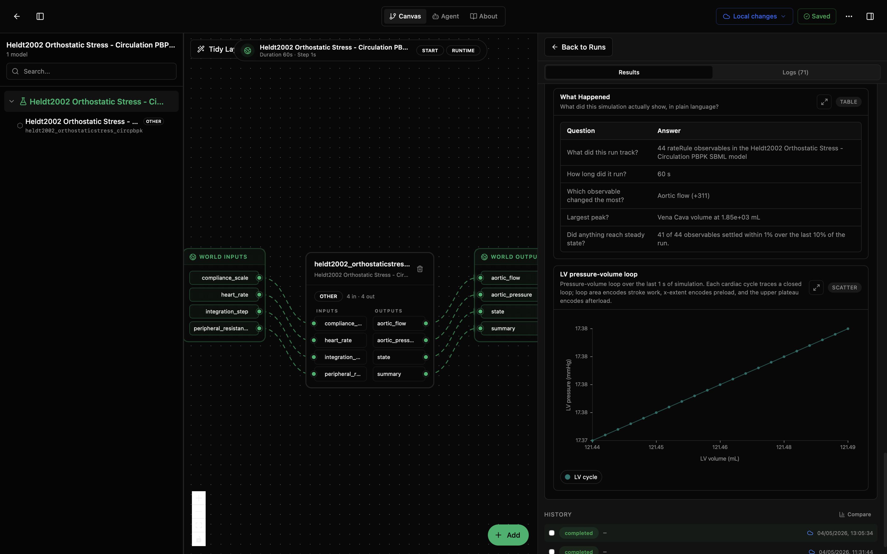

# Heldt2002 Orthostatic Stress - Circulation PBPK Lab

This lab runs the Heldt et al. (2002) circulation PBPK model for orthostatic stress. It asks: when posture changes and venous return is challenged, how do chamber volumes, central vessels, systemic vessels, peripheral tissue beds, venous reservoirs, and tracer-like compartment variables respond over the first minute?

The model wraps the BioModels EBI SBML asset [MODEL1006230084](https://www.ebi.ac.uk/biomodels/MODEL1006230084). The SBML dynamics are encoded as rate rules rather than ordinary floating species, so the wrapper tracks 44 observable variables and groups them into physiology-facing result panels.

## What You'll See

The lab opens as a canvas with one Heldt2002 circulation PBPK node and a run-results panel. A default run lasts 60 s and produces grouped time-series panels for cardiac chambers, central vessels, systemic arteries, peripheral tissues, venous return, aortic flow, substrate/tracer redistribution, and other observed variables, plus summary diagnostics.

The first screenshot shows the canvas and the top result panels for cardiac chamber and central vessel volumes. The second scrolls down to the substrate/tracer redistribution panel and largest-excursions diagnostic. The third shows the plain-language What Happened table and the LV pressure-volume loop.







## How to Read the Visualizations

The cardiac chamber volume plot shows left/right atrial and ventricular filling over time. The central vessel and systemic arterial plots show how major vascular compartments redistribute volume during the orthostatic stress event.

The peripheral tissue and venous return panels show where blood pools and how the venous reservoir responds. The PBPK-oriented substrate panel tracks tracer amount across systemic, cardiac, coronary, pulmonary, and tissue compartments.

The lower diagnostics summarize the run without reading every line. In the shown PBPK run, the What Happened table reports 44 tracked rate-rule observables, a 60 s duration, aortic flow as the largest signed change, vena cava volume as the largest peak, and 41 of 44 observables settling within 1% over the final 10% of the run.

The LV pressure-volume loop plots left-ventricular pressure against volume over the final cycle window. In this PBPK submodel the default loop is nearly collapsed, so use it as a sanity check for the exported LV variables; use `heldt2002-lpc` when you need a full clinical-style pressure-volume loop.

## What This Lab Contains

- `lab.yaml` describes the lab, runtime, and IO wiring.
- `wiring-layout.json` places the model on the canvas.
- `model/model.yaml` describes the model package, parameters, upstream SBML source, and ports.
- `model/src/heldt2002_orthostaticstress_circpbpk.py` wraps the SBML model and builds the grouped visualizations.
- `model/data/MODEL1006230084.xml` is the curated SBML model file from BioModels EBI.
- `model/tests/` contains smoke tests for instantiation, simulation advance, visual output shape, and lab IO.

## Inputs

- `heart_rate` (`1/min`): cardiac pacing rate.
- `peripheral_resistance_scale` (`dimensionless`): multiplier for systemic peripheral resistances.
- `compliance_scale` (`dimensionless`): multiplier for unstressed compartment volumes, used as a compliance-like perturbation.
- `integration_step` (`s`): output sampling step for the Tellurium simulator.

## Outputs

- `aortic_flow`: cycle-averaged aortic flow over the model's headline window.
- `aortic_pressure`: cycle-averaged aortic pressure over the model's headline window.
- `state`: latest values of the tracked rate-rule observables.
- `summary`: final, peak, minimum, and largest-change diagnostics for the run.

## Recreate and Run with the Biosim CLI

From this lab folder:

```bash
cd /path/to/models-biomechanics/labs/heldt2002-circulation-pbpk
mkdir -p dist
python -m biosim pack build . --out dist/heldt2002-circulation-pbpk.bsilab
python -m biosim pack run dist/heldt2002-circulation-pbpk.bsilab
```

## Run in the Desktop App

1. Open Biosimulant Desktop.
2. Go to Projects or Labs.
3. Choose the option to open or import an existing lab.
4. Select this folder's `lab.yaml`.
5. Open the lab and press Run.

The right side of the app should show the grouped PBPK circulation result panels and summary diagnostics.

## How to Edit It

For scenario changes, start with `lab.yaml` and `model/model.yaml`.

- Change `runtime.duration` in `lab.yaml` for a longer or shorter simulation.
- Change `runtime.communication_step` if you want more or fewer reported points.
- Change `heart_rate`, `peripheral_resistance_scale`, or `compliance_scale` to perturb the circulation scenario.
- Change `integration_step` in `model/model.yaml` for finer or coarser Tellurium output sampling.

To change the physiology itself, edit or replace `model/data/MODEL1006230084.xml`. Edit `model/src/heldt2002_orthostaticstress_circpbpk.py` only if you are changing observables, labels, grouping, or visualization behavior.
