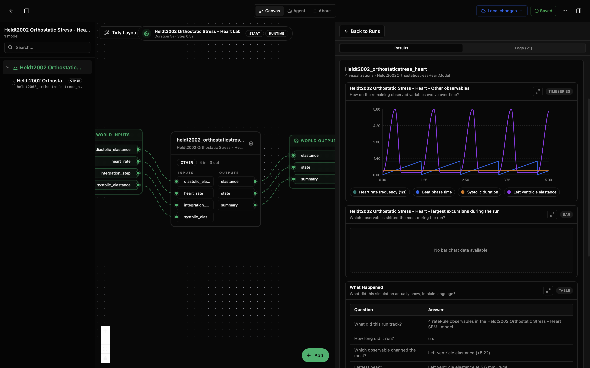
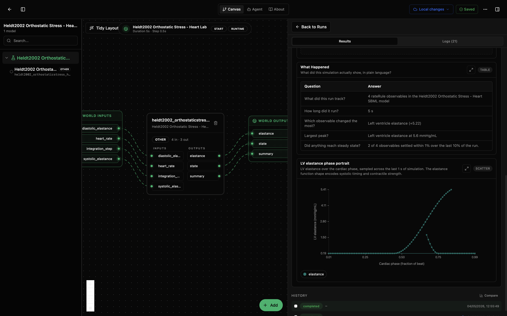

# Heldt2002 Orthostatic Stress - Heart Lab

This lab runs the Heldt et al. (2002) isolated heart submodel from the orthostatic-stress cardiovascular system. It asks: how does the model's time-varying left-ventricular elastance waveform evolve across beats, and how do heart rate, systolic elastance, and diastolic elastance shape that contraction profile?

The model wraps the BioModels EBI SBML asset [MODEL1006230103](https://www.ebi.ac.uk/biomodels/MODEL1006230103). Unlike the LPC and circulation-PBPK labs, this heart-only submodel does not contain chamber volume, pressure, or flow states. Its `models/core` package focuses on timing helpers and the left-ventricular elastance function that drives the larger circulation models, while `models/visualisation` owns the phase portrait, summary table, and user-facing explanation.

## What You'll See

The lab opens as a canvas with one Heldt2002 heart node and a run-results panel. A default run lasts 5 s and produces an elastance/timing time series, a largest-excursions diagnostic, a What Happened table, and an LV elastance phase portrait.

The first screenshot shows the canvas, the elastance/timing time series, and the run summary table. The second scrolls down to the same summary table and the LV elastance phase portrait.





## How to Read the Visualizations

The elastance/timing plot shows the heart-rate frequency, beat phase time, systolic duration, and left-ventricular elastance over the 5 s run. The purple elastance trace rises sharply during systole and returns toward the diastolic baseline between beats.

The What Happened table summarizes the run in plain language. In the shown run, it reports 4 tracked assignment-rule observables, a 5 s duration, left-ventricular elastance as the largest-changing observable, a peak elastance of 5.6 mmHg/mL, and 2 of 4 observables settling within 1% over the final 10% of the run.

The LV elastance phase portrait plots elastance against cardiac phase from 0 to 1 over the last beat. This is not a pressure-volume loop: the heart-only SBML has no LV volume or pressure state. Instead, the curve shows the elastance function shape directly, with systolic rise, peak contractility, relaxation, and diastolic baseline.

## What This Lab Contains

- `lab.yaml` describes the lab, runtime, inputs, outputs, and default model parameters.
- `wiring-layout.json` places the model on the canvas.
- `models/core/model.yaml` describes the SBML execution package, upstream source, parameters, and ports.
- `models/core/src/heldt2002_orthostaticstress_heart.py` wraps the SBML model and publishes stable numeric outputs.
- `models/core/data/MODEL1006230103.xml` is the curated SBML model file from BioModels EBI.
- `models/visualisation/` contains the internal presentation model for charts and narrative logic.
- `models/*/tests/` contains smoke tests for core execution and visualisation behavior.

## Inputs

- `heart_rate` (`1/min`): cardiac pacing rate.
- `systolic_elastance` (`mmHg/mL`): peak systolic LV elastance; higher values model stronger contractility.
- `diastolic_elastance` (`mmHg/mL`): diastolic LV elastance; lower values model better filling compliance.
- `integration_step` (`s`): output sampling step for the Tellurium simulator.

## Outputs

- `elastance`: cycle-averaged left-ventricular elastance over the model's headline window.
- `state`: latest values of the observed timing and elastance variables.
- `summary`: final, peak, minimum, and largest-change diagnostics for the run.

## Recreate and Run with the Biosim CLI

From this lab folder:

```bash
cd /path/to/models-biomechanics/labs/heldt2002-heart
mkdir -p dist
python -m biosim pack build . --out dist/heldt2002-heart.bsilab
python -m biosim pack run dist/heldt2002-heart.bsilab
```

If you are working from this monorepo without installing `biosim`, use the local package environment instead:

```bash
mkdir -p dist
/path/to/bsim-active/biosim/.venv/bin/python -m biosim pack build . --out dist/heldt2002-heart.bsilab
/path/to/bsim-active/biosim/.venv/bin/python -m biosim pack run dist/heldt2002-heart.bsilab
```

## Run in the Desktop App

1. Open Biosimulant Desktop.
2. Go to Projects or Labs.
3. Choose the option to open or import an existing lab.
4. Select this folder's `lab.yaml`.
5. Open the lab and press Run.

The right side of the app should show the elastance waveform, summary table, and elastance phase portrait.

## How to Edit It

For scenario changes, start with `lab.yaml` and `models/core/model.yaml`.

- Change `runtime.duration` in `lab.yaml` for a longer or shorter simulation.
- Change `runtime.communication_step` if you want more or fewer reported points.
- Change `heart_rate`, `systolic_elastance`, or `diastolic_elastance` to perturb the contraction waveform.
- Change `integration_step` in `models/core/model.yaml` for finer or coarser Tellurium output sampling.

To study full chamber pressure-volume behavior, use `heldt2002-lpc`; this heart-only lab exposes the elastance driver rather than a complete circulation.
