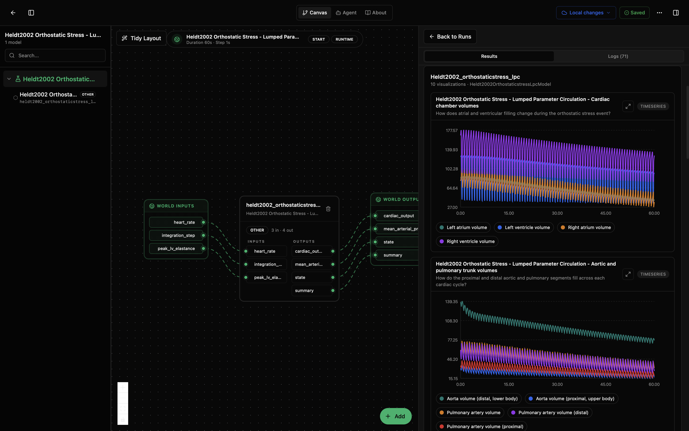
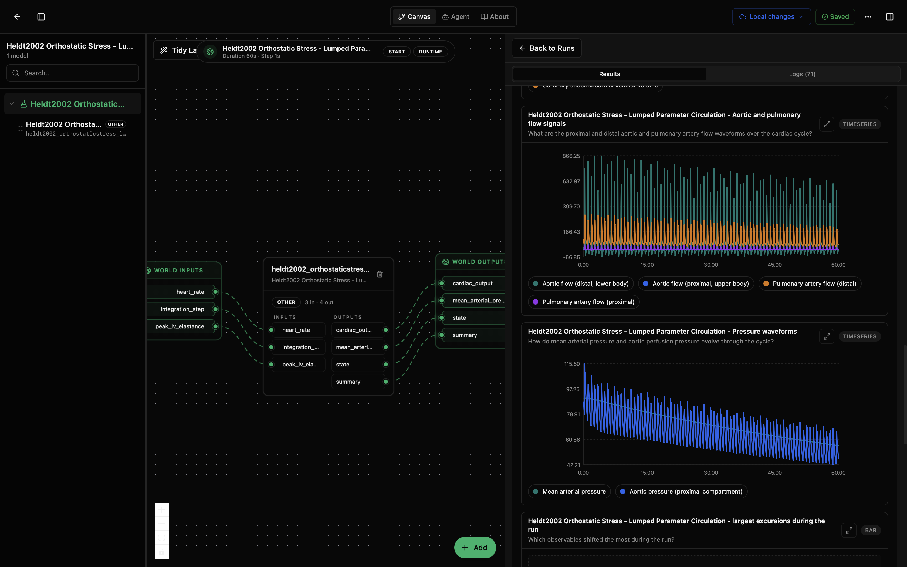
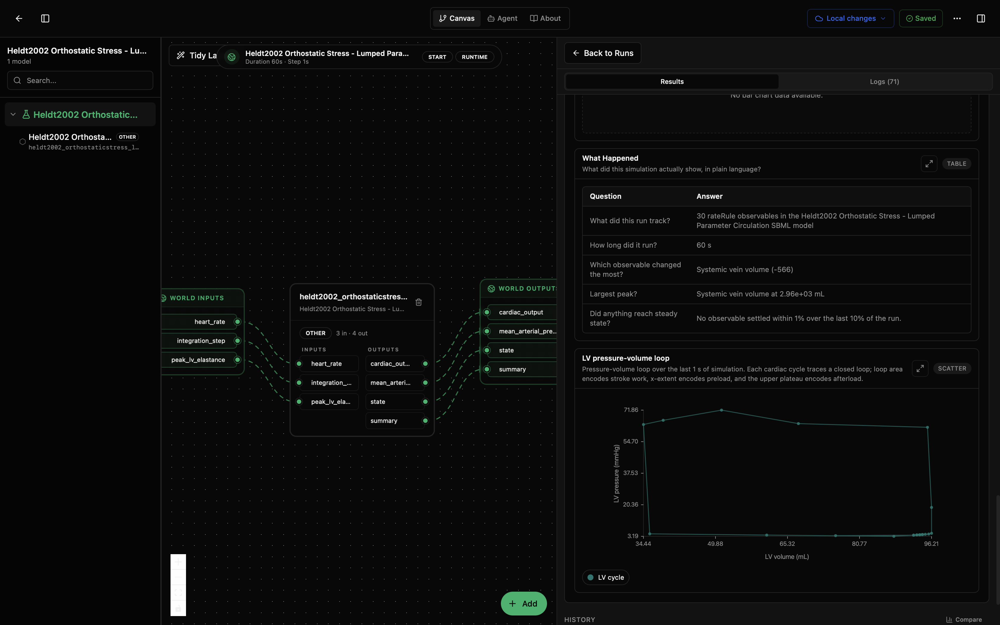

# Heldt2002 Orthostatic Stress - Lumped Parameter Circulation Lab

This lab runs the Heldt et al. (2002) lumped-parameter circulation model. It asks: how do cardiac filling, aortic and pulmonary flow, mean arterial pressure, and the left-ventricular pressure-volume loop respond during a 60 s orthostatic-stress circulation run?

The model wraps the BioModels EBI SBML asset [MODEL1006230113](https://www.ebi.ac.uk/biomodels/MODEL1006230113). The SBML dynamics are encoded as rate rules, so the wrapper tracks 30 observable variables and promotes stable headline outputs for cardiac output and mean arterial pressure.

## What You'll See

The lab opens as a canvas with one Heldt2002 LPC node and a run-results panel. A default run produces grouped time-series panels for chamber volumes, aortic and pulmonary trunk volumes, pulmonary/systemic/coronary perfusion, flow waveforms, pressure waveforms, a largest-excursions diagnostic, a What Happened table, and an LV pressure-volume loop.

The first screenshot shows the canvas and top result panels for cardiac chamber volumes plus aortic and pulmonary trunk volumes. The second scrolls down to aortic/pulmonary flow waveforms and pressure waveforms. The third shows the What Happened table and the LV pressure-volume loop.







## How to Read the Visualizations

The cardiac chamber plot shows left/right atrial and ventricular filling across repeated cardiac cycles. The aortic and pulmonary trunk plot separates proximal and distal vascular segments so you can compare how each segment fills and drains.

The flow and pressure panels are the main hemodynamic readouts. They show pulsatile aortic and pulmonary flow waveforms, plus mean arterial pressure and proximal aortic pressure across the same 60 s run.

The What Happened table summarizes the run without reading every trace. In the shown run, it reports 30 tracked rate-rule observables, systemic vein volume as both the largest signed change and largest peak, and no observable settling within 1% over the final 10% of the run.

The LV pressure-volume loop shows the last cardiac cycle as pressure against volume. Loop area corresponds to stroke work, x-extent to preload, and the upper pressure plateau to afterload.

## What This Lab Contains

- `lab.yaml` describes the lab, runtime, inputs, outputs, and default model parameters.
- `wiring-layout.json` places the model on the canvas.
- `model/model.yaml` describes the model package, upstream SBML source, parameters, and ports.
- `model/src/heldt2002_orthostaticstress_lpc.py` wraps the SBML model and builds the grouped visualizations.
- `model/data/MODEL1006230113.xml` is the curated SBML model file from BioModels EBI.
- `model/tests/` contains smoke tests for instantiation, simulation advance, visual output shape, and lab IO.

## Inputs

- `heart_rate` (`1/min`): cardiac pacing rate.
- `peak_lv_elastance` (`mmHg/mL`): peak left-ventricle elastance; higher values model stronger contractility.
- `integration_step` (`s`): output sampling step for the Tellurium simulator.

## Outputs

- `cardiac_output`: cycle-averaged cardiac output over the model's headline window.
- `mean_arterial_pressure`: cycle-averaged mean arterial pressure over the model's headline window.
- `state`: latest values of the tracked rate-rule observables.
- `summary`: final, peak, minimum, and largest-change diagnostics for the run.

## Recreate and Run with the Biosim CLI

From this lab folder:

```bash
cd /path/to/models-biomechanics/labs/heldt2002-lpc
mkdir -p dist
python -m biosim pack build . --out dist/heldt2002-lpc.bsilab
python -m biosim pack run dist/heldt2002-lpc.bsilab
```

If you are working from this monorepo without installing `biosim`, use the local package environment instead:

```bash
mkdir -p dist
/path/to/bsim-active/biosim/.venv/bin/python -m biosim pack build . --out dist/heldt2002-lpc.bsilab
/path/to/bsim-active/biosim/.venv/bin/python -m biosim pack run dist/heldt2002-lpc.bsilab
```

## Run in the Desktop App

1. Open Biosimulant Desktop.
2. Go to Projects or Labs.
3. Choose the option to open or import an existing lab.
4. Select this folder's `lab.yaml`.
5. Open the lab and press Run.

The right side of the app should show grouped cardiovascular result panels, summary diagnostics, and the LV pressure-volume loop.

## How to Edit It

For scenario changes, start with `lab.yaml` and `model/model.yaml`.

- Change `runtime.duration` in `lab.yaml` for a longer or shorter simulation.
- Change `runtime.communication_step` if you want more or fewer reported points.
- Change `heart_rate` or `peak_lv_elastance` to perturb the circulation scenario.
- Change `integration_step` in `model/model.yaml` for finer or coarser Tellurium output sampling.

To change the physiology itself, edit or replace `model/data/MODEL1006230113.xml`. Edit `model/src/heldt2002_orthostaticstress_lpc.py` only if you are changing observables, labels, grouping, or visualization behavior.
