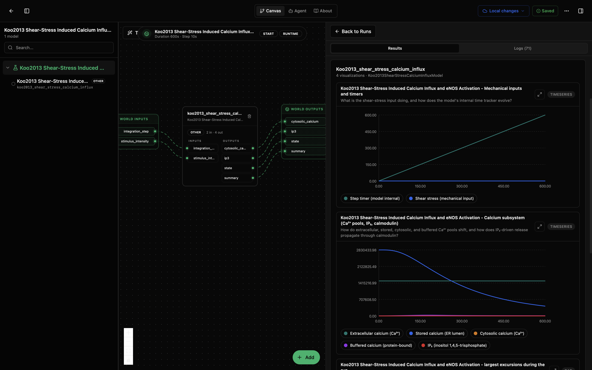
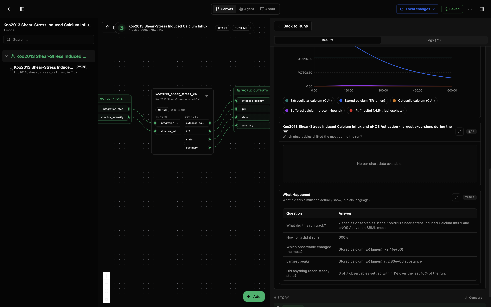

# Koo2013 Shear-Stress Induced Calcium Influx and eNOS Activation Model

This model package wraps BioModels EBI `BIOMD0000000464`, the Koo2013 calcium-influx/eNOS-activation submodel. It exposes cytosolic calcium and IP3 as headline outputs and groups the observed species into canvas-friendly mechanotransduction panels.

With the bundled lab defaults, the simulator runs for 600 s and reports mechanical-input/timer traces, calcium-subsystem species, largest-excursion diagnostics, and a What Happened table.

## What You'll See

## How to Read the Visualizations

The mechanical-input panel shows the step timer and shear-stress input species. Use `stimulus_intensity`, not the decorative SBML shear-stress species, as the practical stimulus control; it maps to the IP3-producing rate constant `k1`.

The calcium-subsystem panel shows extracellular calcium, ER-stored calcium, cytosolic calcium, buffered calcium, and IP3. In the shown run, stored calcium is the largest changing pool.

The What Happened table summarizes the same run. In the screenshot, it reports 7 tracked species observables, a 600 s run, stored calcium in the ER lumen as the largest signed change and largest peak, and 3 of 7 observables settling within 1% over the final 10% of the run.

## What This Model Contains

| Path | Purpose |
|---|---|
| `model.yaml` | Model package, parameters, units, IO, and upstream metadata. |
| `src/koo2013_shear_stress_calcium_influx.py` | Tellurium-backed SBML wrapper and visualization builder. |
| `data/BIOMD0000000464.xml` | Curated SBML model file from BioModels EBI. |
| `tests/` | Smoke tests for instantiation, simulation advance, visuals, and lab IO. |

## Inputs

| Input | Unit | Meaning |
|---|---|---|
| `stimulus_intensity` | 1/s | IP3 production rate constant `k1`, used as the shear-stress-driven mechanotransduction knob. |
| `integration_step` | s | Output sampling step for the Tellurium simulator. |

## Outputs

| Output | Meaning |
|---|---|
| `cytosolic_calcium` | Cytosolic Ca2+ amount averaged over the headline window. |
| `ip3` | IP3 amount averaged over the headline window. |
| `state` | Latest values of observed species. |
| `summary` | Final, peak, minimum, and largest-change diagnostics. |

## Notes

The published SBML declares a shear-stress species that is not referenced by kinetic laws. The wrapper exposes `stimulus_intensity` as the practical control because it maps to `k1`, the IP3-production rate constant used by the model as the shear-stress surrogate.
