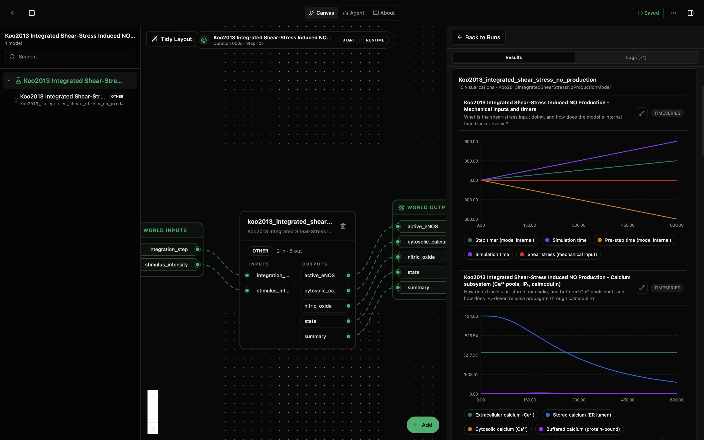
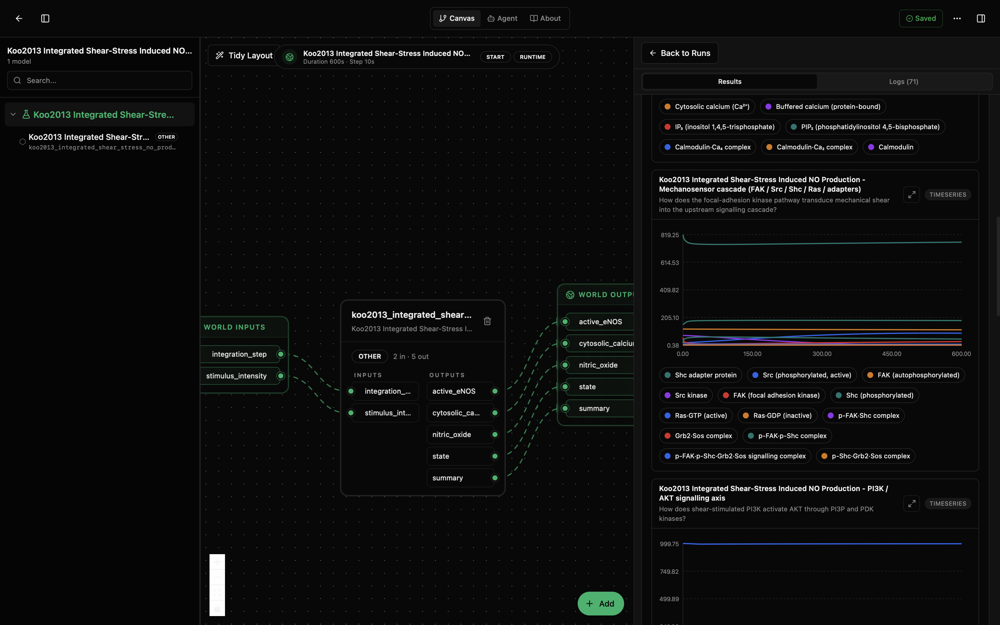
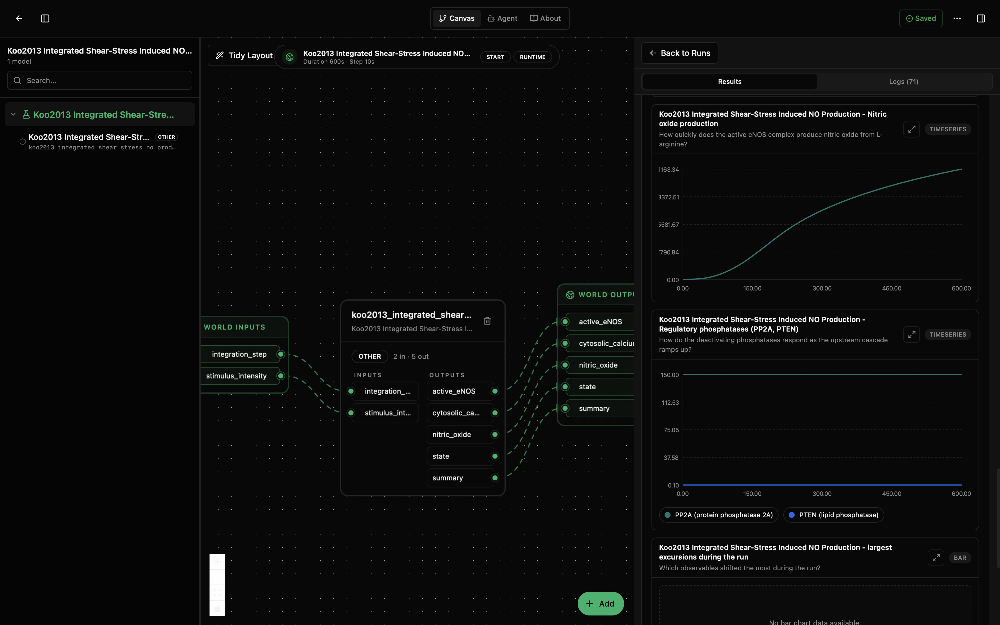
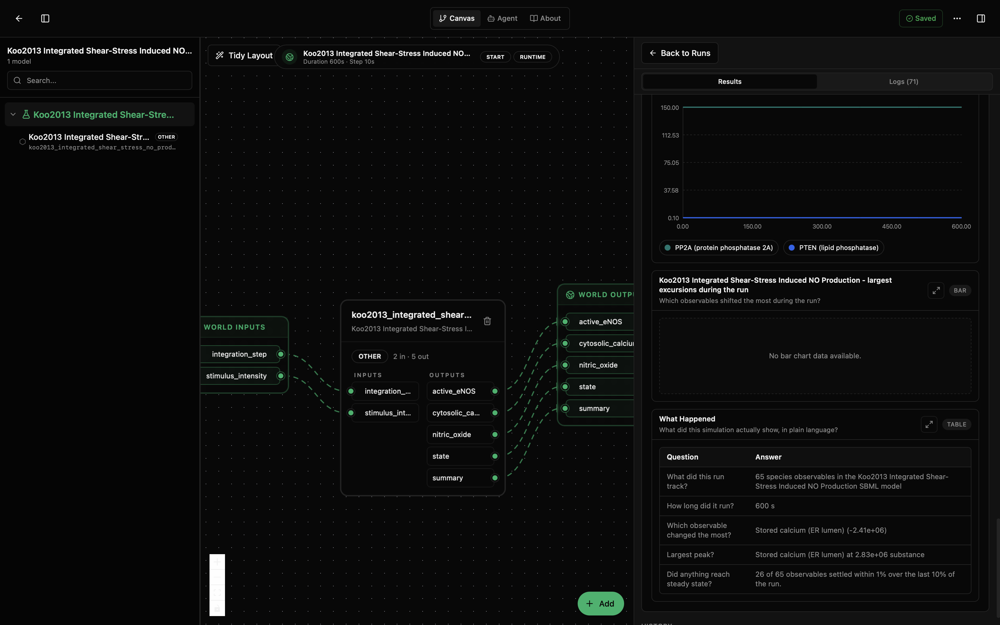

# Koo2013 Integrated Shear-Stress Induced NO Production Lab

This lab wraps the integrated Koo et al. (2013) endothelial mechanotransduction model from BioModels source `BIOMD0000000468`. The canvas model is named `koo2013_integrated_shear_stress_no_production`, matching the screenshots below, and connects a shear-stress stimulus surrogate through calcium handling, mechanosensor signalling, eNOS activation, and nitric oxide production.

Use this lab when the question is the end-to-end NO-production response rather than the isolated calcium-influx or NO-production submodules.

## Results Preview

The default published run spans 600 s and renders 10 visualization panels. The first view shows the canvas wiring beside the mechanical-input and calcium-subsystem plots. `stimulus_intensity` acts as the practical shear-stress input by driving IP3 production, while the calcium panel tracks extracellular, stored, cytosolic, buffered, IP3, and calmodulin-related pools.

The mid-run results expose the upstream signalling cascade. The mechanosensor panel follows FAK, Src, Shc, Ras, and adapter complexes, while the adjacent PI3K/AKT panel shows the downstream kinase axis that links mechanical stimulation to eNOS regulation.

The later panels focus on vasoactive output and negative regulation. Nitric oxide accumulates across the 600 s run as the active eNOS complex converts L-arginine, while PP2A and PTEN provide the regulatory phosphatase context.

The summary view reports 65 species observables, identifies stored calcium in the ER lumen as the largest excursion, and notes that 26 of 65 observables settled within 1% over the final 10% of the run.

## Model Files

| Path | Purpose |
|---|---|
| `lab.yaml` | Lab title, IO wiring, runtime defaults, and canvas metadata. |
| `model/model.yaml` | Model package metadata, parameters, inputs, outputs, and units. |
| `model/src/koo2013_integrated_shear_stress_no_production.py` | Tellurium-backed wrapper and visualization definitions. |
| `model/data/BIOMD0000000468.xml` | Curated SBML model file from BioModels. |
| `model/tests/` | Smoke coverage for model construction, stepping, and outputs. |

## Inputs and Outputs

Inputs:

- `stimulus_intensity` (`1/s`): IP3-production rate constant `k1`; the model's practical shear-stress stimulus surrogate.
- `integration_step` (`s`): Tellurium output sampling interval.

Outputs:

- `active_eNOS`: active eNOS-CaM-Ca4 complex amount, averaged over the wrapper's headline window.
- `cytosolic_calcium`: cytosolic calcium amount, averaged over the wrapper's headline window.
- `nitric_oxide`: nitric oxide amount, averaged over the wrapper's headline window.
- `state`: latest values for the tracked named species.
- `summary`: final, peak, minimum, and excursion diagnostics for the run.

## Notes

The upstream SBML `Shear Stress` species is decorative in this wrapper; use `stimulus_intensity` for perturbation experiments. The `state` output carries 65 named species after filtering mass-balance placeholders from the 79-species SBML model.
