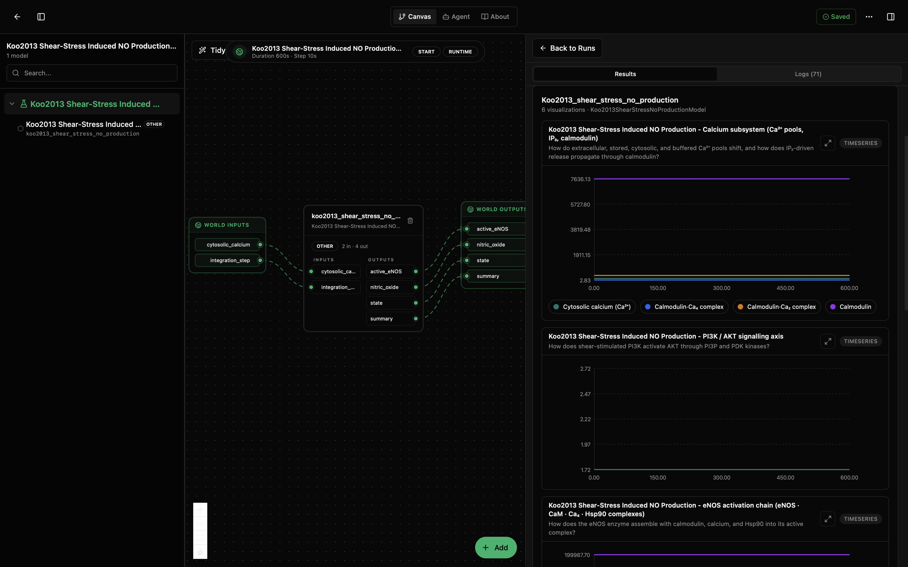
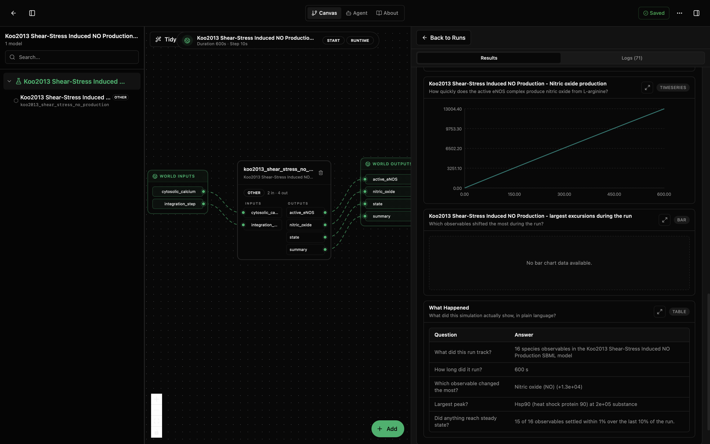

# Koo2013 Shear-Stress Induced NO Production Lab

This lab wraps the Koo et al. (2013) NO-production submodel from BioModels source `BIOMD0000000467`. The screenshots below were checked against the visible run alias `koo2013_shear_stress_no_production`, which matches this lab and its model package. The `models/core` package handles SBML execution and numeric outputs, while `models/visualisation` owns internal grouped charts and narrative logic.

Use this lab for the downstream half of the endothelial shear-stress pathway: cytosolic calcium is treated as an external input, then the model follows eNOS activation and nitric oxide production.

## Results Preview

The default run spans 600 s and renders six visualization panels. The first view shows the canvas wiring beside the calcium subsystem, PI3K/AKT signalling axis, and eNOS activation-chain panels. The model input is `cytosolic_calcium`, so these panels are best read as the downstream response to a fixed or upstream-supplied calcium signal.

The summary view highlights the nitric oxide output. In the captured run, NO rises across the 600 s simulation; the What Happened table reports 16 species observables, names nitric oxide as the largest-changing observable (`+1.3e+04`), and notes that 15 of 16 observables settled within 1% over the final 10% of the run.

## Model Files

| Path | Purpose |
|---|---|
| `lab.yaml` | Lab title, IO wiring, runtime defaults, and canvas metadata. |
| `models/core/model.yaml` | Core SBML execution package metadata, parameters, inputs, outputs, and units. |
| `models/core/src/koo2013_shear_stress_no_production.py` | Tellurium-backed SBML execution wrapper. |
| `models/core/data/BIOMD0000000467.xml` | Curated SBML model file from BioModels. |
| `models/visualisation/` | Internal presentation model for charts and narrative logic. |
| `models/*/tests/` | Smoke coverage for core execution and visualisation behavior. |

## Inputs and Outputs

Inputs:

- `cytosolic_calcium` (`substance`): external calcium signal used by the NO-production submodel.
- `integration_step` (`s`): Tellurium output sampling interval.

Outputs:

- `active_eNOS`: active eNOS-CaM-Ca4 complex amount, averaged over the wrapper's headline window.
- `nitric_oxide`: nitric oxide amount, averaged over the wrapper's headline window.
- `state`: latest values for the 16 tracked named species.
- `summary`: final, peak, minimum, and excursion diagnostics for the run.

## Notes

This is the downstream Koo2013 submodel. It does not include the calcium-influx pathway; compose it with `koo2013-calcium-influx` or use `koo2013-integrated` when the experiment needs the full shear-stress-to-NO chain.
